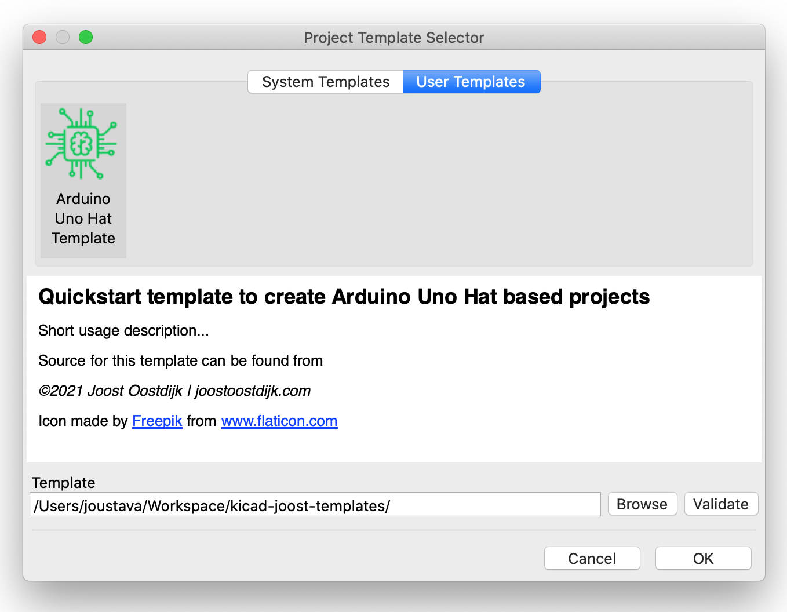

# Arduino Uno template project for KiCad EDA

> This is a KiCad [template](https://docs.kicad.org/5.1/en/kicad/kicad.html#project_templates) to quickstart creating shields for Arduino Uno. The template is created according to the KiCad [documentation](https://docs.kicad.org/5.1/en/kicad/kicad.html#creating_templates) on templates. There are probably better versions somewhere on the internets or even one build in however, I wanted to get some more KiCad experience, so here you go!

## Installation

Download or clone this GitHub repository to your [KiCad user templates directory](https://docs.kicad.org/5.1/en/kicad/kicad.html#template_locations)

## Usage

1. Open KiCad
2. Choose: "create a new project from template"
3. In the "Project Template Selector" choose "User Templates" tab
4. Browse to the directory where your user templates are
5. Select the template and go design!

| Project Template Selector |
|---------------------------|
|  |

| Template in 3D Viewer |
|---------------------------|
|  |

*Note*
This GitHub project itself can also be used as a template to create new GitHub repositories, see [creating-a-repository-from-a-template](https://docs.github.com/en/github/creating-cloning-and-archiving-repositories/creating-a-repository-from-a-template) for details.

## Resource

- [KiCad](https://kicad.org/)
- [Arduino](https://www.arduino.cc/)
- [Arduino Uno](https://store.arduino.cc/arduino-uno-rev3)
## Contributing

Pull requests are welcome. For major changes, please open an issue first to discuss what you would like to change.
Please make sure to update docs as appropriate.

## License

[MIT](https://choosealicense.com/licenses/mit/)